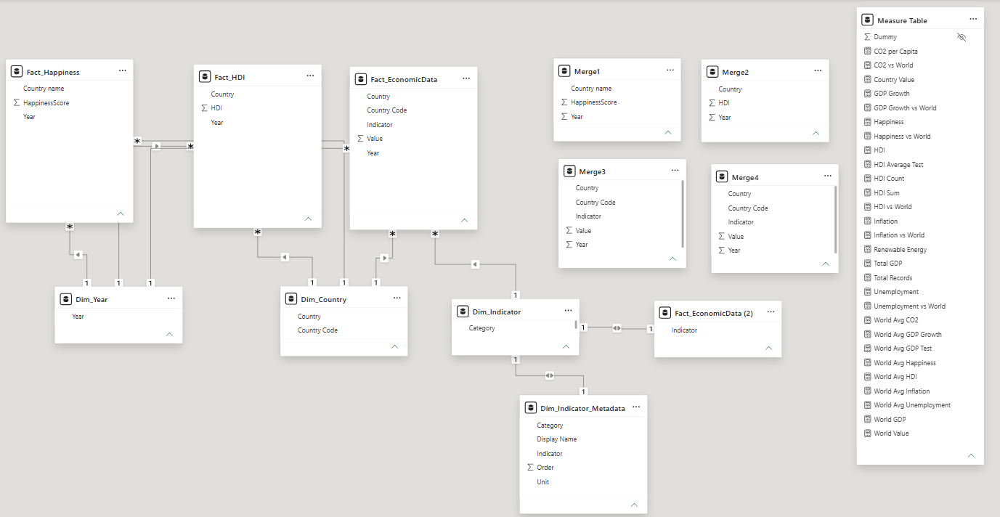
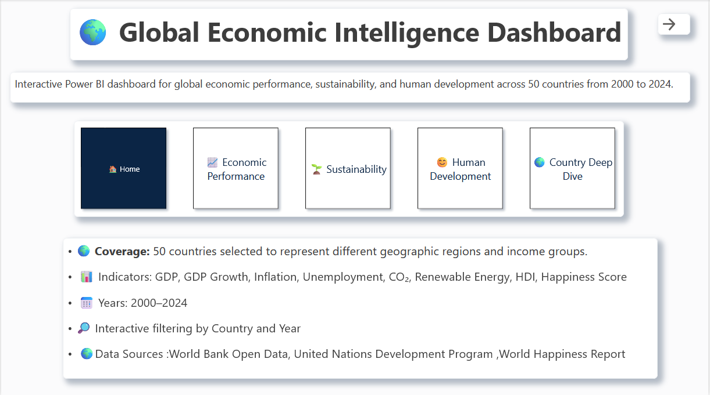
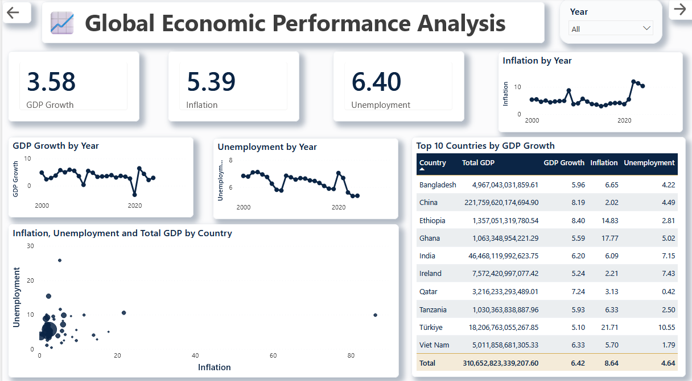
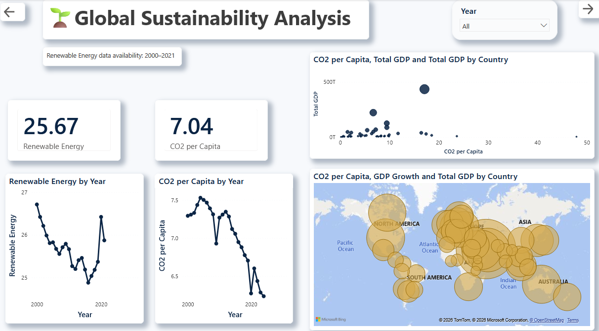
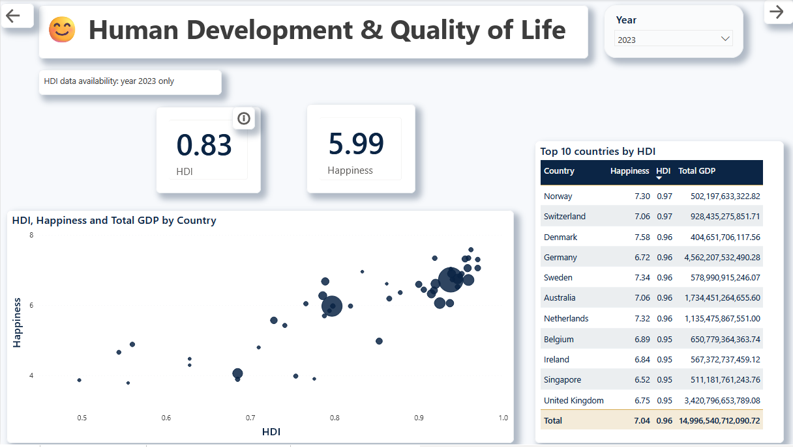
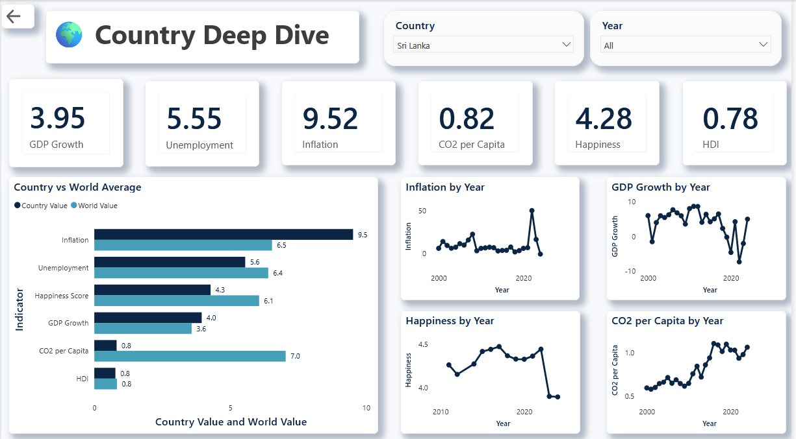

# Global Economic Intelligence Dashboard

An interactive **Power BI analytics dashboard** designed to explore global economic performance, sustainability, and human development across **50 countries from 2000-2024**.

This project integrates multiple public datasets into a unified analytical model, allowing users to analyze trends, compare countries, and understand relationships between economic, environmental, and social indicators.

---

# Project Highlights

- Analysis across **50 countries**
- Historical data coverage from **2000-2024**
- Multiple economic and development indicators
- Custom DAX measures and calculations
- Star schema data model
- Interactive country and year filtering
- Multi-page analytical dashboard

---

# Dashboard Pages

## Home

The landing page provides:
- Project overview
- Data coverage information
- Dashboard navigation
- Exploration guidance

---

## Economic Performance

Analyzes global economic trends through:

- GDP
- GDP Growth
- Inflation
- Unemployment

Includes:
- Historical trend analysis
- Country comparisons
- Economic benchmarking

---

## Sustainability

Explores environmental indicators:

- CO₂ Emissions
- Renewable Energy Consumption

Includes:
- Sustainability trends
- Country comparisons
- Environmental performance analysis

---

## Human Development

Focuses on quality-of-life indicators:

- Human Development Index (HDI)
- Happiness Score

Includes:
- Development comparisons
- HDI and happiness relationships
- Human development trends

---

## Country Deep Dive

Provides detailed analysis of a selected country:

- Country KPI overview
- Country vs World comparison
- Economic trends
- Sustainability indicators
- Human development metrics

---

# Features

- Interactive country and year slicers
- Multi-page report navigation
- Dynamic KPI calculations
- World average comparisons
- Trend analysis
- Interactive visualizations
- Custom DAX measures
- Star schema data modeling
- Informative tooltips for key indicators

---

# Data Model

The dashboard follows a **Star Schema architecture** to improve data organization, relationship management, and analytical performance.

## Fact Tables

- Economic Indicators
- HDI
- Happiness

## Dimension Tables

- Country
- Year

### Data Model Diagram



---

# Data Sources

This project uses publicly available datasets from:

- World Bank Open Data
- United Nations Development Programme (UNDP)
- World Happiness Report

The datasets were cleaned, standardized, and transformed before being integrated into the Power BI data model.

---

# Technologies Used

- Microsoft Power BI
- Power Query
- DAX
- Data Modeling
- Data Visualization
- Business Intelligence Concepts

---

# Dashboard Preview

## Home




## Economic Performance




## Sustainability




## Human Development




## Country Deep Dive



---

# Repository Structure

```
global-economic-intelligence-dashboard/
│
├── Global_Economic_Intelligence_Dashboard.pbix
├── README.md
│
├── data/
│   └── README.md
│
├── images/
│   ├── home.png
│   ├── economic-performance.png
│   ├── sustainability.png
│   ├── human-development.png
│   └── country-deep-dive.png
│
└── docs/
    └── data-model.png
```

---

# Future Improvements

- Publish dashboard using Power BI Service
- Add drill-through analysis pages
- Improve mobile layout optimization
- Expand country coverage
- Add forecasting and predictive analytics capabilities

---

# Author

**Adeesha Akeeth**

BSc (Hons) Information Technology
Specializing in Data Science (Undergraduate)